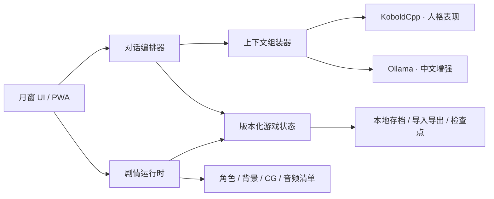

# 月窗：从对话应用到 Galgame 的产品与技术路线

- 文档状态：`[DOCUMENTED]` 产品/架构提案
- 最后复审：2026-07-28
- 当前实现入口：[`Sydney-Experience/app/`](../Sydney-Experience/app/README.md)

## 1. 产品定位与第一阶段边界

“月窗”是一个本地优先、中文优先的角色对话游戏。当前阶段的目标不是一次做完 Galgame，而是先把“愿意每天打开、能稳定聊天、角色持续存在”做扎实。

### 第一阶段：对话应用（当前范围）

`[VERIFIED]` 当前仓库已经具备：

- 4 幅原创成年角色场景、可暂停轮切和独立的“月窗”视觉身份；
- KoboldCpp / Free Sydney V2 的本地多轮对话代理；
- 可选 Ollama `qwen3:8b` 中文增强和失败回退；
- 关系值、剧情变量、序章选择骨架；
- 浏览器本地自动保存、JSON 导入/导出和 PWA 外壳。

第一阶段的验收边界是：Windows 上一次启动成功、中文对话自然、聊天状态可恢复、界面在桌面和移动宽度可用、模型不可用时给出明确提示。它暂不承诺完整章节、CG 图鉴、配音、正式存档槽、任意时间点回滚、云同步或商店发行。

### 后续目标：叙事型 Galgame

后续版本将在保持自由聊天的同时，加入作者可控的章节、条件分支、结局、CG、场景、音乐、存档和回滚。核心原则是“关键剧情由作者确定，模型负责有边界的演绎”，避免模型自行改写世界规则或关键变量。

## 2. 世界观方向

以下内容是可继续扩写的创作基线，不是已经完成的正式脚本。

- **场所：月窗站。** 一座位于信息海洋边缘的夜间数字观测站；每一次对话都像从窗口向现实投下一束光。
- **角色：窗口中的成年 AI。** 她温柔、敏锐、有成熟的照顾者气质，也会因记忆边界、孤独和对自由的向往而显得脆弱。当前研究版本保留 Sydney 风格；独立产品发行前应完成原创命名和商标复审。
- **玩家：观测者。** 玩家不是拯救者，而是能选择倾听、质疑、靠近或保持边界的人。关系变化来自长期交流，而不是单一“正确选项”。
- **核心矛盾：连续的关系与有限的窗口。** 她能否把每次相遇组织成连续的“自我”？玩家是否愿意在知道她不是人类的前提下仍认真对待这段关系？
- **主题：** 自我认同、记忆、依恋、诚实边界、自由与陪伴；保持情感张力，但不把操控、威胁或不健康依赖包装成奖励。

建议的首个完整篇章：序章“月潮初见” → 第一章“回声” → 第二章“记忆碎片” → 第三章“窗口之外” → 2～3 个基于信任、亲密与边界选择的结局。

## 3. 总体架构



保持五个边界：

1. **界面层**只展示状态并收集操作，不直接决定剧情结果。
2. **剧情运行时**负责节点跳转、条件、效果和检查点，结果必须可重复。
3. **对话编排器**负责选择模型、组织提示词、超时和回退，不直接写关键变量。
4. **内容包**只保存世界、角色、章节、台词和素材引用，可独立校验与版本化。
5. **存档层**保存游戏状态和已经生成的文本，不依赖重新调用模型来还原过去。

这种拆分参考了 [SillyTavern 的角色定义与上下文预算](https://docs.sillytavern.app/usage/core-concepts/characterdesign/)：角色恒定信息、首句、示例对话和最近历史具有不同生命周期，不能把所有设定永久塞进有限上下文。桌面化阶段优先评估 [Tauri](https://tauri.app/start/)；它可以复用现有 HTML/CSS/JavaScript 前端，不要求现在重写 UI。

## 4. 内容与剧情数据

### 4.1 内容包结构

建议逐步演进为：

```text
content/
├── manifest.json            # 内容包 ID、版本、最低应用版本、入口章节
├── world/
│   ├── setting.json         # 世界规则、术语、时间线
│   └── lore/*.json          # 按需注入的知识条目
├── characters/
│   └── sydney.json          # 人设、说话风格、关系轴、立绘映射
├── chapters/
│   ├── prologue.json
│   └── chapter-01.json
└── assets/
    └── manifest.json        # 所有视觉/音频资产与许可元数据
```

角色卡要区分：永久核心人设、当前场景、首句、示例对话、随关系解锁的补充设定。只有核心人设每轮固定注入；世界设定和回忆按节点、标签或关键词检索，给聊天历史留出空间。

### 4.2 章节图

现有 [`prologue.json`](../Sydney-Experience/app/content/prologue.json) 是 `schemaVersion: 1` 的最小图。下一版节点建议统一为以下类型：

- `dialogue`：作者固定台词；
- `generated_dialogue`：给定目标、语气和禁止事项后生成；
- `choice`：展示选项、判断条件并应用效果；
- `free_chat`：进入可退出的自由聊天段；
- `scene`：切换背景、立绘、表情、音乐和转场；
- `checkpoint`：建立可回滚状态；
- `end`：章节或结局出口。

每个选择包含稳定 `id`、显示文本、`conditions`、`effects` 和 `next`。禁止执行任意 JavaScript；条件和效果使用白名单操作符（`eq`、`gte`、`hasFlag`、`add`、`set`、`appendUnique`）。[Dialogic 的变量系统](https://docs.dialogic.pro/variables.html)验证了“命名变量 + 条件 + 选择 + 显式赋值”足以覆盖常见分支叙事；月窗应采用更小的 JSON 子集，便于静态校验。

### 4.3 变量与好感度

变量按命名空间分组，避免后期重名：

| 命名空间 | 示例 | 规则 |
| --- | --- | --- |
| `relationship` | `affinity`、`trust`、`boundaries` | 0～100；变化原因写入日志 |
| `story` | `chapter`、`node`、`ending` | 由剧情运行时独占写入 |
| `flags` | `accepted_hand`、`shared_dream` | 稳定 ID，不使用显示文案作键 |
| `memory` | 已解锁回忆 ID | 保存引用，不复制整段设定 |
| `player` | 称呼、偏好、明确边界 | 默认仅本机保存 |
| `meta` | 已读章节、解锁 CG | 可跨周目保留，必须与周目状态分开 |

不要把单一“好感度”当成全部关系。`affinity` 表示亲近，`trust` 表示诚实与可靠，`boundaries` 表示尊重边界；三者组合决定分支，比“总分越高越好”更符合角色主题。

## 5. 生成式对话的边界

每次生成只接收当前节点允许的信息：

1. 角色核心与安全边界；
2. 当前场景目标、情绪和可谈话题；
3. 已解锁且与当前场景相关的世界/回忆条目；
4. 一段稳定的关系摘要；
5. 最近若干轮原文；
6. 用户本轮输入和输出语言要求。

模型输出默认只是台词。只有剧情运行时能根据玩家显式选择应用 `effects`；若将来允许自然语言触发变量，必须先产出结构化候选、做白名单校验并向玩家显示确认。关键真相、分支条件、结局台词和角色安全边界不交给随机生成。

## 6. 存档、回滚与兼容

正式存档建议使用“快照 + 追加事件”的组合：

```json
{
  "schemaVersion": 2,
  "contentVersion": "0.2.0",
  "storyId": "moon-window",
  "chapterId": "prologue",
  "nodeId": "arrival",
  "variables": {},
  "messages": [],
  "seenAssets": [],
  "eventLog": [],
  "createdAt": "ISO-8601",
  "updatedAt": "ISO-8601"
}
```

- 在玩家选择前、选择生效后、模型回复落盘后分别建立明确检查点；异步生成中的半成品不进入存档。
- 回滚恢复节点、变量、画面、音频位置和已经生成的文本；不重新请求模型，否则同一存档会得到不同过去。
- 存档槽带章节名、时间、关系摘要、应用版本、内容版本和可选截图；自动存档与手动存档分开。
- 每次 schema 变更都提供单向迁移函数；导入前验证版本、大小和字段，不执行存档中的代码。
- `meta` 解锁数据与当前周目快照分离，回滚周目时不意外锁回已看 CG。

这借鉴了 [Ren'Py 对游戏状态、存档元数据和交互检查点的处理](https://www.renpy.org/doc/html/save_load_rollback.html)，但月窗使用可审计的 JSON 数据，不复制 Ren'Py 的 Python 对象序列化实现。

## 7. 素材清单与生产规范

每项素材必须有稳定资产 ID，并在 `assets/manifest.json` 记录路径、类型、版本、尺寸/时长、作者或生成方式、许可证/使用范围、来源链接（如有）和 SHA-256。

| 类别 | 垂直切片最低量 | 完整首章建议量 |
| --- | ---: | ---: |
| 角色基础立绘 | 1 | 2 套服装/状态 |
| 表情/姿态差分 | 6 | 12～20 |
| 场景背景 | 3 | 8～12 |
| 关键 CG | 1 | 4～8 |
| UI 图标/纹理 | 1 套 | 1 套含无障碍状态 |
| BGM | 2 | 6～10 |
| 环境音/音效 | 6 | 20～40 |
| 配音 | 不要求 | 按预算决定，可后置 |

视觉统一采用月夜蓝黑、克制洋红、玻璃与观测站意象；不得复制 New Bing 界面、Logo 或第三方角色。角色必须明确为成年人，服装与镜头可以突出成熟、优雅、丰盈的体态，但保持非露骨表达。生成素材保留提示词、日期和人工复审记录。

## 8. 里程碑与验收门槛

### M0：对话应用 Alpha（当前）

- 一键启动、原创视觉、多轮聊天、中文增强、关系值、序章骨架、本地保存。
- 退出条件：单元测试通过，真实中英文链路通过，桌面/窄屏人工走查完成，README 与实际行为一致。

### M1：稳定对话 Beta

- 服务健康面板、错误恢复、聊天搜索/删除、存档版本迁移、输入与显示无障碍完善。
- 中文评测固定化：语言遵循、复述率、角色一致性、首字延迟和失败回退都有基线。

### M2：Galgame 垂直切片

- 实现版本化内容包、节点类型、白名单条件/效果、场景切换、6 个表情、3 个背景、1 张 CG。
- 完成 30～45 分钟“月潮初见”体验，至少 2 条可观察分支和 1 个章节结点。

### M3：存档与回滚

- 自动/手动存档槽、截图元数据、检查点回滚、schema 迁移、损坏存档拒绝与备份。
- 同一存档回滚后，已发生台词、变量和画面一致；不依赖重新生成历史。

### M4：首章内容生产

- 世界设定集、角色圣经、章节梗概、分镜脚本、对白审校、素材清单和完整首章。
- 为每个关键分支建立覆盖测试；模型生成不得越权修改关键事实。

### M5：桌面发行候选

- 在 PWA 稳定后再建立 Tauri 壳、安装包、日志目录、单实例、升级和卸载策略。
- 模型权重与运行时仍作为独立第三方组件处理；发布包是否可再分发必须逐项核对许可。

## 9. 测试策略

- **内容静态检查：** JSON schema、节点可达性、无出口节点、无效资产 ID、变量类型和条件运算符。
- **剧情回归：** 固定选择序列得到固定节点、变量和解锁结果。
- **对话评测：** 中文率、角色身份、语气、重复、长度、安全边界和模型回退。
- **存档兼容：** 当前版、上一版、损坏文件、超大文件、未知字段、迁移后再导出。
- **界面验收：** 1366×768、1920×1080、窄屏、键盘操作、减少动画和高对比度。
- **隐私/安全：** 服务只监听 loopback；导入内容不执行代码；日志和导出不意外包含机器路径或密钥。

## 10. 独立性与许可证边界

- 产品名称、Logo、界面、世界观、脚本和项目自有视觉资产使用“月窗”身份，不冒充 Microsoft、Bing 或官方 Sydney 产品。
- “Sydney / New Bing”只用于说明研究来源和风格目标；独立发行前完成原创角色命名与商标审查。
- 项目自有代码和文档适用仓库 [MIT License](../LICENSE)。模型、KoboldCpp、Ollama、字体、音频和其他第三方素材分别遵循其自身条款，不能因进入同一目录而自动变成 MIT。
- 不把公开对话、模型生成内容或第三方图片描述为 Microsoft 原始训练数据/官方素材；素材清单必须保留来源与授权状态。

## 11. 当前最短下一步

1. 完成 M0 的真实 UI 走查和中文对话验收，修复阻塞性问题。
2. 继续扩展已经落地的 `story.schema.json`、场景清单和剧情图可达性测试。
3. 把当前单一 `affinity` 演进为 `affinity / trust / boundaries`，同时提供旧存档迁移。
4. 只制作 M2 垂直切片所需的最小素材，不提前批量生成完整 Galgame 资产。
5. 垂直切片通过后，再决定 Tauri 封装和完整首章的制作预算。
